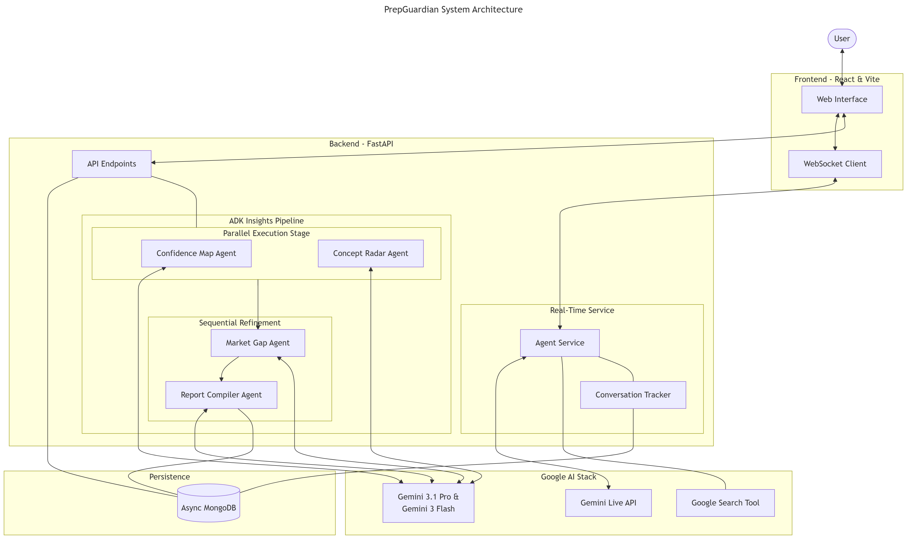

# PrepGuardian 🛡️

PrepGuardian is a live AI companion designed to transform how users learn and prepare for high-stakes scenarios. Built entirely within the **Antigravity IDE** and powered by **Google’s fundamental AI stack**, it provides a seamless, multi-modal interaction experience that feels less like a tool and more like a dedicated mentor.

---

## 🚀 How it Works (The Flow)

PrepGuardian operates in a continuous, low-latency loop that bridges the gap between digital content and human interaction:

1.  **Context Injection**: The user triggers a session, and their specific background (experience, goals, and learning style) is dynamically injected into the agent's context.
2.  **Live Interaction**: Users engage with the agent via real-time voice and screen sharing. The agent "sees" what the user sees and hears what they say.
3.  **Intelligent Reasoning**: Powered by Gemini Live (ADK), the agent processes visual and auditory cues simultaneously to provide contextual feedback, solve problems, or conduct mock interviews.
4.  **Graceful Termination**: Sessions end with a clean wrap-up, where transcripts are automatically saved and processed for future review, ensuring no insight is lost.

## ✨ What PrepGuardian Does Well

*   **Human-First Interaction**: Uses real-time voice and interruption-aware audio to make conversations feel natural and fluid.
*   **Visual Awareness**: Through integrated screen sharing, users can have a collaborative learning experience simulating a real-world whiteboarding session.
*   **Low Friction**: No complex setup. Start a session, share your goals, and get straight to work.

## 🛠️ Tech Stack

### AI & Core Engine
*   **Google ADK**: For robust, streaming-first agent architecture.
*   **Google Live API (Gemini 2.5 Flash Native audio)**: The brain behind the multi-modal reasoning.
*   **Google AI (Gemini 3.1 pro & Gemini 3 flash)**: The models behind analysis & insights generation.
*   **Antigravity IDE**: The primary development environment used to build this entire stack.

### Backend
*   **FastAPI**: For high-performance, asynchronous API endpoints.
*   **Python 3.14**: Utilizing the latest language features for speed and reliability.
*   **UV**: Used for lightning-fast dependency management and builds.
*   **MongoDB (Motor)**: Async storage for user context and conversation transcripts.

### Frontend
*   **React & Vite**: A modern, snappy user interface.
*   **TanStack Query**: For efficient server-state management.
*   **Tailwind CSS 4**: For a lean, high-fidelity design system.

---

## 🏁 Getting Started

Follow these instructions to get the project up and running on your local machine.

### Prerequisites

*   [Python 3.14+](https://www.python.org/)
*   [UV](https://github.com/astral-sh/uv) (Fast Python package manager)
*   [Node.js](https://nodejs.org/) (LTS recommended)
*   [MongoDB](https://www.mongodb.com/try/download/community) (Running locally or a cloud URI)

### 1. 📂 Clone the Repository

```bash
git clone https://github.com/eeshsingh123/PrepGuardian.git
cd PrepGuardian
```

### 2. ⚙️ Backend Setup

```bash
cd backend

# 1. Install dependencies and create venv using uv
uv sync

# 2. Configure Environment Variables
# Create a .env file in the backend directory OR update \backend\app\config.py with:
MONGO_URI="mongodb://localhost:27017"
REDIS_URL="redis://localhost:6379/0"
JWT_SECRET_KEY="replace-with-openssl-rand-hex-32"
GOOGLE_CLOUD_PROJECT="your-project-id"

# 3. Spin up the server
uv run uvicorn main:app --reload
```

### 3. 🎨 Frontend Setup

```bash
cd ../frontend

# 1. Install dependencies
npm install

# 2. Configure Environment Variables
# Create a .env file in the frontend directory with:
# VITE_API_BASE_URL=http://localhost:8000

# 3. Start the development server
npm run dev
```

---

## 🏗️ Architecture


